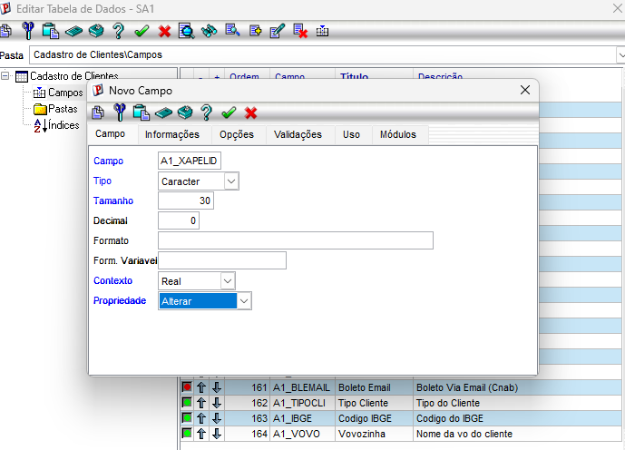
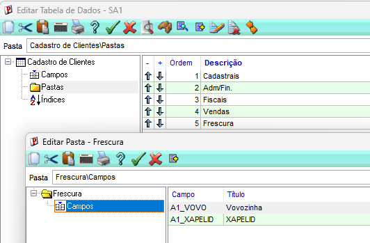
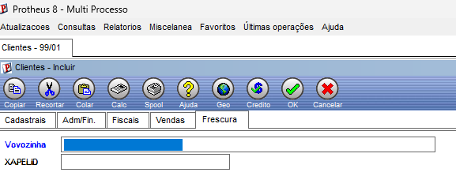

# 📝 Exercício 4 — Campo customizado na SA1 ⚙️

> **Objetivo:** criar um campo customizado na tabela `SA1`, seguindo o mesmo padrão do `A1_VOVO` criado em aula.

---

# ✅ Resposta

> Feito na pasta **`EVIDENCIAS_EX04`**.

