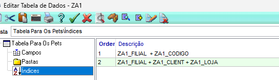
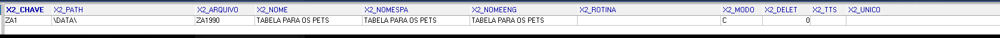
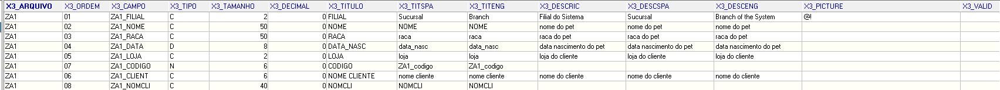

# 📝 Exercício 2 — Completando a tabela ZA1 (o pet ganha um dono) ⭐

> **Objetivo:** completar a tabela `ZA1` (Pets) com os campos apresentados no módulo.

---

# ✅ Resposta

> **Realizado conforme solicitado.**

### Configurações aplicadas

- Campos configurados com os tipos e tamanhos corretos;
- Campo `ZA1_NOMCLI` configurado como **Virtual**, utilizando a relação:

```advpl
POSICIONE("SA1",1,xFilial("SA1")+M->ZA1_CLIENT+M->ZA1_LOJA,"A1_NOME")
```

- Índices (SIX) configurados:

| Ordem | Expressão |
| :---: | :-------- |
| **1** | `ZA1_FILIAL + ZA1_COD` |
| **2** | `ZA1_FILIAL + ZA1_CLIENT + ZA1_LOJA` |

---

## 📷 Evidências

> Feito na pasta **`EVIDENCIAS_EX02`**.





